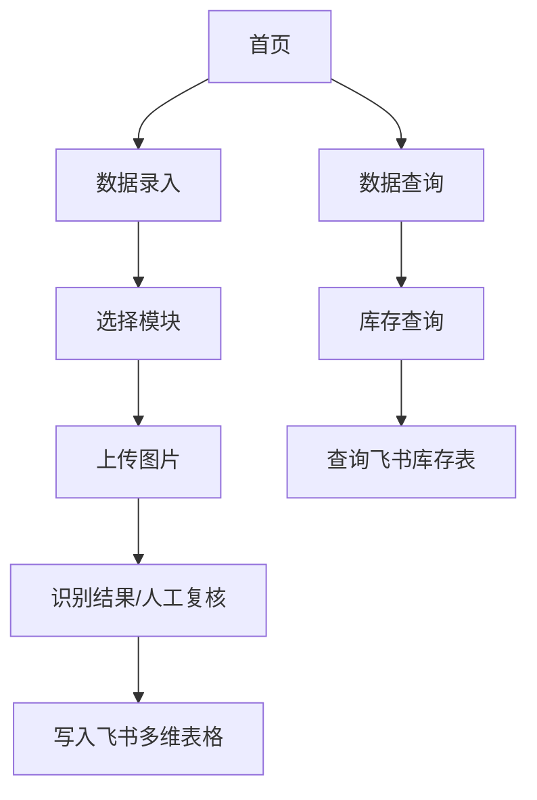

## 1. 产品概述

box2bitable 是一个基于豆包大模型的鞋盒标签识别微信小程序。用户拍照/选择鞋盒标签图片后，系统自动识别并返回多条记录，经人工复核后按模块规则写入飞书多维表格；同时提供库存查询能力，输入货号即可查询该货号下各尺码数量分布。

## 2. 核心功能

### 2.1 信息架构（两大板块）

- **数据录入**：采购 / 销售 / 库存 三个模块
- **数据查询**：库存查询（按货号）

### 2.2 模块能力与口径

- **采购/库存**
  - 支持一图多条记录识别与人工复核
  - 按 `SKU_Code` 聚合后写入飞书
  - 数量口径为“写入时累加（upsert 累加数量）”
- **销售（明细流水）**
  - 支持一图多条记录识别与人工复核
  - 人工补充：数量、金额(元)、支付方式（单选）、备注
  - 每条复核记录均写入为一条明细流水（不使用 `SKU_Code` 作为唯一键）

## 3. 核心流程

### 3.1 数据录入

1. 选择模块（采购/销售/库存）
2. 上传鞋盒标签图片
3. 调用豆包大模型识别（返回多条记录）
4. 人工复核与补充字段（销售模块包含人工字段）
5. 后端按模块规则写入飞书多维表格（并返回逐条同步结果）

### 3.2 库存查询

1. 进入“数据查询-库存查询”
2. 输入货号并查询
3. 后端调用飞书库存表接口，按尺码汇总数量
4. 前端展示尺码-数量列表

## 4. User Interface Design

### 4.1 Design Style
- 主色调：微信绿色 (#07C160) 和白色背景
- 按钮样式：圆角矩形，主要操作为实心主按钮，次要操作为边框按钮
- 字体：使用微信默认字体，标题18px，正文16px，适应移动端阅读
- 布局风格：单列布局，顶部导航栏，底部操作栏，符合小程序设计规范
- 图标风格：使用微信官方图标库，简洁线性风格

### 4.2 Page Design Overview
| Page Name | Module Name | UI Elements |
|-----------|-------------|-------------|
| 首页 | 两大入口 | 数据录入 / 数据查询 |
| 数据录入 | 模块选择 | 采购 / 销售 / 库存 |
| 数据录入 | 图片上传 | 相机/相册选择、预览、开始识别 |
| 数据录入 | 人工复核 | 按模块动态渲染字段；销售包含人工字段 |
| 数据录入 | 同步结果 | 逐条成功/失败展示，失败可重试 |
| 数据查询 | 库存查询 | 输入货号、展示尺码-数量结果列表 |

### 4.3 Responsiveness
采用移动端优先设计，专为微信小程序优化：
- 适配各种手机屏幕尺寸（375px-430px主
- 支持触摸手势操作（滑动、捏合、长按）
- 考虑单手操作便利性，重要按钮放在屏幕下半部分
- 支持离线使用，网络恢复后自动同步数据
- 优化电池使用，合理控制摄像头和GPS使用频率

### 4.4 小程序特有功能
- **摄像头调用**：支持高质量拍照，自动对焦和曝光调节
- **本地缓存**：使用微信本地存储，支持离线操作
- **网络适配**：智能判断网络状态，支持WiFi和移动数据
- **权限管理**：相机、相册、网络等权限动态申请
- **分享功能**：支持识别结果分享给同事或导出图片
