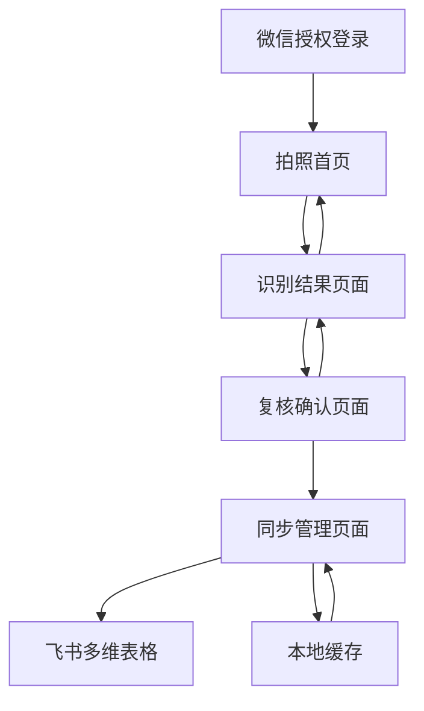

## 1. Product Overview
box2bitable是一个基于豆包大模型的鞋盒标签识别微信小程序，通过小程序拍照或选择图片，自动识别标签信息并展示结果，经人工复核后聚合SKU数据并同步至飞书多维表格。

解决鞋盒标签人工录入效率低、易出错的问题，帮助仓库管理人员通过手机快速准确地完成库存数据录入，提升供应链管理效率。小程序形态便于现场操作，支持离线缓存和移动端特性。

## 2. Core Features

### 2.1 User Roles
| Role | Registration Method | Core Permissions |
|------|---------------------|------------------|
| 仓库管理员 | 飞书账号登录 | 上传图片、查看识别结果、人工复核、同步数据 |
| 系统管理员 | 飞书账号登录 | 系统配置、用户管理、数据审计 |

### 2.2 Feature Module
box2bitable微信小程序包含以下核心页面：
1. **拍照首页**：摄像头拍照、相册选择、图片预览。
2. **识别结果页面**：标签信息展示、编辑修正、单张/批量处理。
3. **复核确认页面**：数据校验、移动端滑动操作、一键确认。
4. **同步管理页面**：SKU聚合、飞书同步、离线缓存管理。

### 2.3 Page Details
| Page Name | Module Name | Feature description |
|-----------|-------------|---------------------|
| 拍照首页 | 摄像头拍照 | 调用微信小程序摄像头API，支持自动对焦和闪光灯控制 |
| 拍照首页 | 相册选择 | 从手机相册选择图片，支持多选，最多9张 |
| 拍照首页 | 图片预览 | 全屏预览拍摄的图片，支持删除重拍 |
| 识别结果页面 | 标签信息展示 | 卡片式展示识别的品牌、型号、尺码、颜色等信息 |
| 识别结果页面 | 移动端编辑 | 点击字段直接编辑，支持下拉选择和手动输入 |
| 识别结果页面 | 批量处理 | 左右滑动切换图片，底部显示处理进度 |
| 复核确认页面 | 数据校验 | 顶部显示异常提醒，红色标记错误字段 |
| 复核确认页面 | 滑动确认 | 右滑确认通过，左滑返回修改，符合移动端操作习惯 |
| 同步管理页面 | SKU聚合 | 按品牌型号分组显示，显示总数量和待同步数量 |
| 同步管理页面 | 一键同步 | 点击同步到飞书，支持网络异常时本地缓存 |
| 同步管理页面 | 离线管理 | 显示本地缓存数据，网络恢复后自动同步 |

## 3. Core Process
用户使用流程：
1. 用户通过微信授权登录小程序
2. 在拍照首页选择摄像头拍照或从相册选择图片
3. 小程序调用豆包大模型API进行标签识别
4. 识别结果展示在页面上，用户可进行移动端编辑修正
5. 通过滑动操作完成复核确认
6. 系统将数据按SKU维度聚合，支持离线缓存
7. 网络可用时自动同步到飞书多维表格

## 4. User Interface Design

### 4.1 Design Style
- 主色调：微信绿色 (#07C160) 和白色背景
- 按钮样式：圆角矩形，主要操作为实心主按钮，次要操作为边框按钮
- 字体：使用微信默认字体，标题18px，正文16px，适应移动端阅读
- 布局风格：单列布局，顶部导航栏，底部操作栏，符合小程序设计规范
- 图标风格：使用微信官方图标库，简洁线性风格

### 4.2 Page Design Overview
| Page Name | Module Name | UI Elements |
|-----------|-------------|-------------|
| 拍照首页 | 拍照区域 | 全屏摄像头预览，底部拍照按钮，右上角相册入口 |
| 拍照首页 | 图片预览 | 全屏显示拍摄的图片，底部删除和确认按钮 |
| 识别结果页面 | 信息卡片 | 圆角卡片展示识别结果，点击字段可编辑，底部导航栏显示进度 |
| 复核确认页面 | 滑动操作 | 卡片式展示待复核数据，右滑确认，左滑返回，顶部显示异常提醒 |
| 同步管理页面 | 聚合列表 | 分组列表显示SKU信息，顶部显示同步状态，底部一键同步按钮 |
| 同步管理页面 | 离线提示 | 网络异常时显示本地缓存提示，网络恢复后自动同步 |

### 4.3 Responsiveness
采用移动端优先设计，专为微信小程序优化：
- 适配各种手机屏幕尺寸（375px-430px主
- 支持触摸手势操作（滑动、捏合、长按）
- 考虑单手操作便利性，重要按钮放在屏幕下半部分
- 支持离线使用，网络恢复后自动同步数据
- 优化电池使用，合理控制摄像头和GPS使用频率

### 4.4 小程序特有功能
- **摄像头调用**：支持高质量拍照，自动对焦和曝光调节
- **本地缓存**：使用微信本地存储，支持离线操作
- **网络适配**：智能判断网络状态，支持WiFi和移动数据
- **权限管理**：相机、相册、网络等权限动态申请
- **分享功能**：支持识别结果分享给同事或导出图片