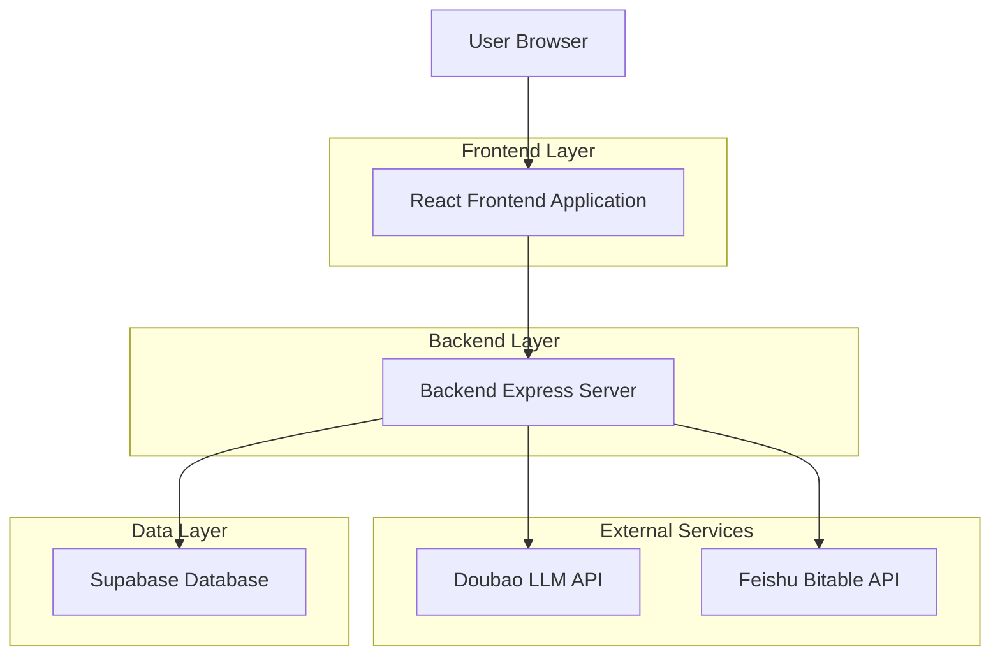
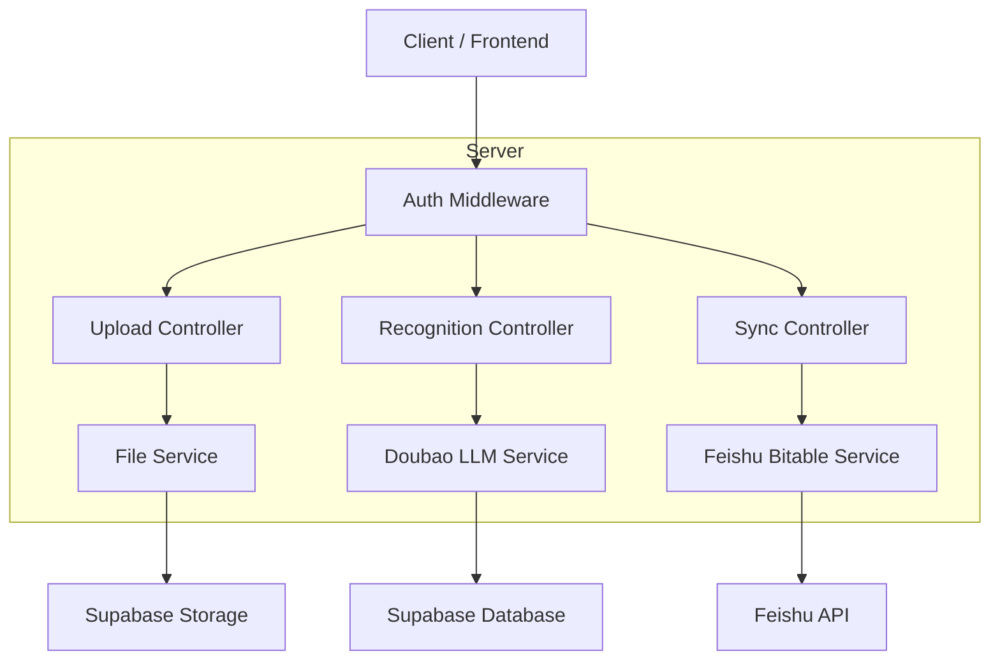
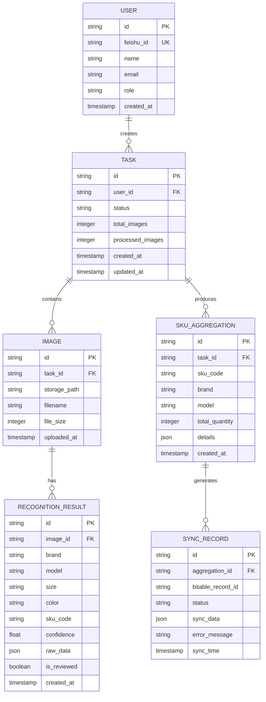

## 1.Architecture design



## 2.Technology Description

* Frontend: React\@18 + tailwindcss\@3 + vite

* Initialization Tool: vite-init

* Backend: Express\@4 + Node.js\@24

* Database: Supabase (PostgreSQL)

* LLM Service: 豆包大模型API

* 文件存储: Supabase Storage

## 3.Route definitions

| Route    | Purpose             |
| -------- | ------------------- |
| /        | 图片上传页面，主要的入口页面      |
| /results | 识别结果展示页面，显示豆包模型识别结果 |
| /review  | 人工复核页面，用于校验和修正识别数据  |
| /sync    | 数据同步页面，SKU聚合和飞书表格同步 |
| /history | 历史记录页面，查看过往同步记录     |
| /login   | 飞书OAuth登录页面         |

## 4.API definitions

### 4.1 图片上传与识别API

```
POST /api/upload
```

Request:

| Param Name | Param Type | isRequired | Description |
| ---------- | ---------- | ---------- | ----------- |
| images     | File\[]    | true       | 鞋盒标签图片文件数组  |
| user\_id   | string     | true       | 用户ID        |

Response:

| Param Name | Param Type | Description                         |
| ---------- | ---------- | ----------------------------------- |
| task\_id   | string     | 识别任务ID                              |
| status     | string     | 任务状态 (pending/processing/completed) |
| results    | array      | 识别结果数组                              |

### 4.2 识别结果获取API

```
GET /api/results/:task_id
```

Response:

| Param Name | Param Type | Description |
| ---------- | ---------- | ----------- |
| task\_id   | string     | 任务ID        |
| results    | array      | 详细的识别结果     |
| confidence | number     | 识别置信度       |

### 4.3 数据同步API

```
POST /api/sync
```

Request:

| Param Name      | Param Type | isRequired | Description |
| --------------- | ---------- | ---------- | ----------- |
| task\_id        | string     | true       | 识别任务ID      |
| reviewed\_data  | object     | true       | 人工复核后的数据    |
| bitable\_config | object     | true       | 飞书多维表格配置    |

## 5.Server architecture diagram



## 6.Data model

### 6.1 Data model definition



### 6.2 Data Definition Language

用户表 (users)

```sql
CREATE TABLE users (
  id UUID PRIMARY KEY DEFAULT gen_random_uuid(),
  feishu_id VARCHAR(100) UNIQUE NOT NULL,
  name VARCHAR(100) NOT NULL,
  email VARCHAR(255),
  role VARCHAR(20) DEFAULT 'warehouse_manager' CHECK (role IN ('warehouse_manager', 'admin')),
  created_at TIMESTAMP WITH TIME ZONE DEFAULT NOW()
);

-- 创建索引
CREATE INDEX idx_users_feishu_id ON users(feishu_id);
```

识别任务表 (recognition\_tasks)

```sql
CREATE TABLE recognition_tasks (
  id UUID PRIMARY KEY DEFAULT gen_random_uuid(),
  user_id UUID NOT NULL REFERENCES users(id),
  status VARCHAR(20) DEFAULT 'pending' CHECK (status IN ('pending', 'processing', 'completed', 'failed')),
  total_images INTEGER DEFAULT 0,
  processed_images INTEGER DEFAULT 0,
  created_at TIMESTAMP WITH TIME ZONE DEFAULT NOW(),
  updated_at TIMESTAMP WITH TIME ZONE DEFAULT NOW()
);

-- 创建索引
CREATE INDEX idx_tasks_user_id ON recognition_tasks(user_id);
CREATE INDEX idx_tasks_status ON recognition_tasks(status);
```

图片表 (task\_images)

```sql
CREATE TABLE task_images (
  id UUID PRIMARY KEY DEFAULT gen_random_uuid(),
  task_id UUID NOT NULL REFERENCES recognition_tasks(id),
  storage_path VARCHAR(500) NOT NULL,
  filename VARCHAR(255) NOT NULL,
  file_size INTEGER,
  uploaded_at TIMESTAMP WITH TIME ZONE DEFAULT NOW()
);

-- 创建索引
CREATE INDEX idx_images_task_id ON task_images(task_id);
```

识别结果表 (recognition\_results)

```sql
CREATE TABLE recognition_results (
  id UUID PRIMARY KEY DEFAULT gen_random_uuid(),
  image_id UUID NOT NULL REFERENCES task_images(id),
  brand VARCHAR(100),
  model VARCHAR(200),
  size VARCHAR(50),
  color VARCHAR(100),
  sku_code VARCHAR(100),
  confidence FLOAT,
  raw_data JSONB,
  is_reviewed BOOLEAN DEFAULT FALSE,
  created_at TIMESTAMP WITH TIME ZONE DEFAULT NOW()
);

-- 创建索引
CREATE INDEX idx_results_image_id ON recognition_results(image_id);
CREATE INDEX idx_results_sku ON recognition_results(sku_code);
```

SKU聚合表 (sku\_aggregations)

```sql
CREATE TABLE sku_aggregations (
  id UUID PRIMARY KEY DEFAULT gen_random_uuid(),
  task_id UUID NOT NULL REFERENCES recognition_tasks(id),
  sku_code VARCHAR(100) NOT NULL,
  brand VARCHAR(100),
  model VARCHAR(200),
  total_quantity INTEGER DEFAULT 0,
  details JSONB,
  created_at TIMESTAMP WITH TIME ZONE DEFAULT NOW()
);

-- 创建索引
CREATE INDEX idx_aggregations_task_id ON sku_aggregations(task_id);
CREATE INDEX idx_aggregations_sku ON sku_aggregations(sku_code);
```

同步记录表 (sync\_records)

```sql
CREATE TABLE sync_records (
  id UUID PRIMARY KEY DEFAULT gen_random_uuid(),
  aggregation_id UUID NOT NULL REFERENCES sku_aggregations(id),
  bitable_record_id VARCHAR(100),
  status VARCHAR(20) DEFAULT 'pending' CHECK (status IN ('pending', 'success', 'failed')),
  sync_data JSONB,
  error_message TEXT,
  sync_time TIMESTAMP WITH TIME ZONE DEFAULT NOW()
);

-- 创建索引
CREATE INDEX idx_sync_aggregation_id ON sync_records(aggregation_id);
CREATE INDEX idx_sync_status ON sync_records(status);
```

\-- 权限设置
GRANT SELECT ON ALL TABLES TO anon;
GRANT ALL PRIVILEGES ON ALL TABLES TO authenticated;
