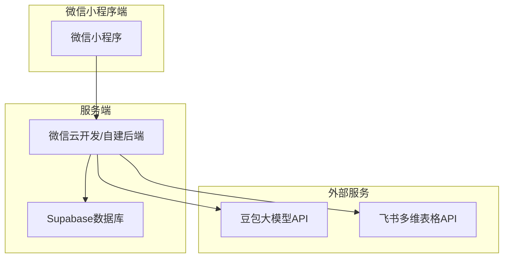
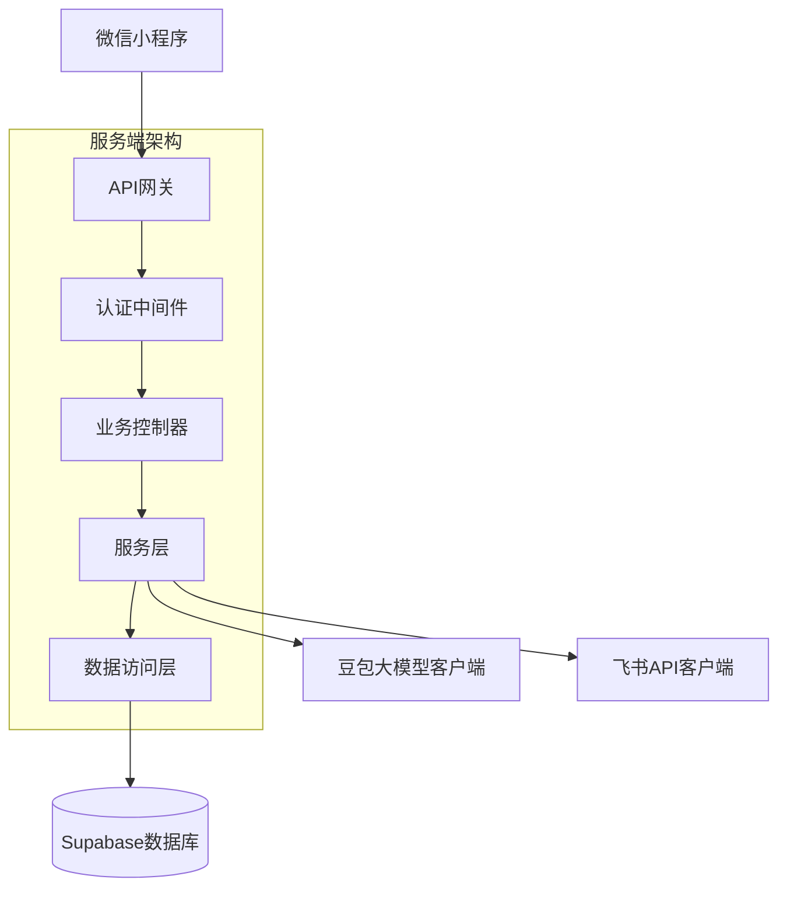

## 1.Architecture design



## 2.Technology Description

- 前端：微信小程序原生开发 + WXML + WXSS + JS + JSON
- 初始化工具：微信开发者工具
- 后端：Node.js + Express（自建）或 微信云开发
- 数据库：Supabase（PostgreSQL）
- 文件存储：微信云存储 或 Supabase Storage
- AI服务：豆包大模型API
- 第三方集成：飞书多维表格API

## 3.Route definitions

| 页面路径 | 页面名称 | 功能描述 |
|---------|---------|----------|
| /pages/home/home | 首页 | 两大入口：数据录入 / 数据查询 |
| /pages/entry/entry | 录入模块选择 | 选择采购/销售/库存 |
| /pages/index/index | 图片上传 | 拍照/相册选择并上传识别 |
| /pages/review/review | 人工复核 | 动态字段复核、同步、失败重试 |
| /pages/query/query | 库存查询 | 输入货号查询尺码与数量 |

## 4.API definitions

### 4.1 图片识别API

```
POST /api/recognition/upload
```

Request:
| 参数名 | 类型 | 必填 | 描述 |
|--------|------|------|------|
| image | file | 是 | 图片文件（multipart/form-data） |
| module | string | 是 | purchase / sales / inventory |

Response:
| 参数名 | 类型 | 描述 |
|--------|------|------|
| success | boolean | 识别是否成功 |
| task_id | string | 文件名标识（用于临时文件定位） |
| db_task_id | string | 数据库任务ID |
| results | array | 识别结果数组（支持一图多条） |

### 4.2 数据同步API

```
POST /api/sync
```

Request:
| 参数名 | 类型 | 必填 | 描述 |
|--------|------|------|------|
| reviewed_data | array | 是 | 人工复核后的数据 |
| task_id | string | 否 | 图片文件名（用于同步阶段兜底上传） |
| db_task_id | string | 否 | 数据库任务ID（用于复用 file_token） |
| module | string | 是 | purchase / sales / inventory |

Response:
| 参数名 | 类型 | 描述 |
|--------|------|------|
| success | boolean | 同步是否成功 |
| results | array | 逐条同步结果（success/failed） |

### 4.3 同步失败重试API

```
POST /api/sync/retry
```

Request:
| 参数名 | 类型 | 必填 |
|--------|------|------|
| db_task_id | string | 是 |
| task_id | string | 否 |
| module | string | 是 |

### 4.4 库存查询API

```
GET /api/query/inventory?item_no=xxx
```

Response:
| 参数名 | 类型 | 描述 |
|--------|------|------|
| success | boolean | 查询是否成功 |
| item_no | string | 货号 |
| rows | array | 尺码-数量列表 |

## 5.Server architecture diagram



## 6.Data model

### 6.1 数据模型定义

```mermaid
erDiagram
    USER ||--o{ RECOGNITION_TASK : creates
    RECOGNITION_TASK ||--o{ SHOE_LABEL : contains
    SHOE_LABEL ||--o{ SKU_AGGREGATION : belongs_to
    SKU_AGGREGATION ||--o{ SYNC_RECORD : has
    
    USER {
        string id PK
        string openid UK
        string nickname
        string avatar_url
        string phone
        timestamp created_at
    }
    
    RECOGNITION_TASK {
        string id PK
        string user_id FK
        string image_url
        string status
        timestamp created_at
        timestamp completed_at
        string error_message
    }
    
    SHOE_LABEL {
        string id PK
        string task_id FK
        string brand
        string model
        string size
        string color
        string sku_code
        float confidence
        boolean is_reviewed
        timestamp reviewed_at
    }
    
    SKU_AGGREGATION {
        string id PK
        string brand
        string model
        string size
        string color
        string sku_code
        integer total_quantity
        integer pending_sync
        timestamp last_updated
    }
    
    SYNC_RECORD {
        string id PK
        string sku_id FK
        string feishu_table_id
        string feishu_record_id
        string status
        timestamp sync_time
        string error_message
    }
```



### 6.2 数据定义语言

用户表（users）
```sql
CREATE TABLE users (
    id UUID PRIMARY KEY DEFAULT gen_random_uuid(),
    openid VARCHAR(100) UNIQUE NOT NULL,
    nickname VARCHAR(100),
    avatar_url TEXT,
    phone VARCHAR(20),
    created_at TIMESTAMP WITH TIME ZONE DEFAULT NOW(),
    updated_at TIMESTAMP WITH TIME ZONE DEFAULT NOW()
);

-- 创建索引
CREATE INDEX idx_users_openid ON users(openid);
CREATE INDEX idx_users_created_at ON users(created_at DESC);
```

识别任务表（recognition_tasks）
```sql
CREATE TABLE recognition_tasks (
    id UUID PRIMARY KEY DEFAULT gen_random_uuid(),
    user_id UUID REFERENCES users(id),
    image_url TEXT NOT NULL,
    status VARCHAR(20) DEFAULT 'pending' CHECK (status IN ('pending', 'processing', 'completed', 'failed')),
    created_at TIMESTAMP WITH TIME ZONE DEFAULT NOW(),
    completed_at TIMESTAMP WITH TIME ZONE,
    error_message TEXT
);

-- 创建索引
CREATE INDEX idx_tasks_user_id ON recognition_tasks(user_id);
CREATE INDEX idx_tasks_status ON recognition_tasks(status);
CREATE INDEX idx_tasks_created_at ON recognition_tasks(created_at DESC);
```

鞋盒标签表（shoe_labels）
```sql
CREATE TABLE shoe_labels (
    id UUID PRIMARY KEY DEFAULT gen_random_uuid(),
    task_id UUID REFERENCES recognition_tasks(id),
    brand VARCHAR(100),
    model VARCHAR(100),
    size VARCHAR(20),
    color VARCHAR(50),
    sku_code VARCHAR(100),
    confidence FLOAT,
    is_reviewed BOOLEAN DEFAULT FALSE,
    reviewed_at TIMESTAMP WITH TIME ZONE,
    created_at TIMESTAMP WITH TIME ZONE DEFAULT NOW()
);

-- 创建索引
CREATE INDEX idx_labels_task_id ON shoe_labels(task_id);
CREATE INDEX idx_labels_sku ON shoe_labels(brand, model, size, color);
CREATE INDEX idx_labels_reviewed ON shoe_labels(is_reviewed);
```

SKU聚合表（sku_aggregations）
```sql
CREATE TABLE sku_aggregations (
    id UUID PRIMARY KEY DEFAULT gen_random_uuid(),
    brand VARCHAR(100),
    model VARCHAR(100),
    size VARCHAR(20),
    color VARCHAR(50),
    sku_code VARCHAR(100) UNIQUE,
    total_quantity INTEGER DEFAULT 0,
    pending_sync INTEGER DEFAULT 0,
    last_updated TIMESTAMP WITH TIME ZONE DEFAULT NOW()
);

-- 创建索引
CREATE INDEX idx_sku_code ON sku_aggregations(sku_code);
CREATE INDEX idx_sku_pending ON sku_aggregations(pending_sync);
```

同步记录表（sync_records）
```sql
CREATE TABLE sync_records (
    id UUID PRIMARY KEY DEFAULT gen_random_uuid(),
    sku_id UUID REFERENCES sku_aggregations(id),
    feishu_table_id VARCHAR(100),
    feishu_record_id VARCHAR(100),
    status VARCHAR(20) DEFAULT 'pending' CHECK (status IN ('pending', 'success', 'failed')),
    sync_time TIMESTAMP WITH TIME ZONE DEFAULT NOW(),
    error_message TEXT
);

-- 创建索引
CREATE INDEX idx_sync_sku_id ON sync_records(sku_id);
CREATE INDEX idx_sync_status ON sync_records(status);
CREATE INDEX idx_sync_time ON sync_records(sync_time DESC);
```

### 6.3 权限设置

```sql
-- 基本权限设置
GRANT SELECT ON ALL TABLES TO anon;
GRANT ALL PRIVILEGES ON ALL TABLES TO authenticated;

-- RLS策略（行级安全）
ALTER TABLE users ENABLE ROW LEVEL SECURITY;
ALTER TABLE recognition_tasks ENABLE ROW LEVEL SECURITY;
ALTER TABLE shoe_labels ENABLE ROW LEVEL SECURITY;
ALTER TABLE sku_aggregations ENABLE ROW LEVEL SECURITY;
ALTER TABLE sync_records ENABLE ROW LEVEL SECURITY;

-- 用户只能查看自己的数据
CREATE POLICY users_own_data ON users FOR ALL USING (auth.uid() = id);
CREATE POLICY tasks_own_data ON recognition_tasks FOR ALL USING (user_id = auth.uid());
```
