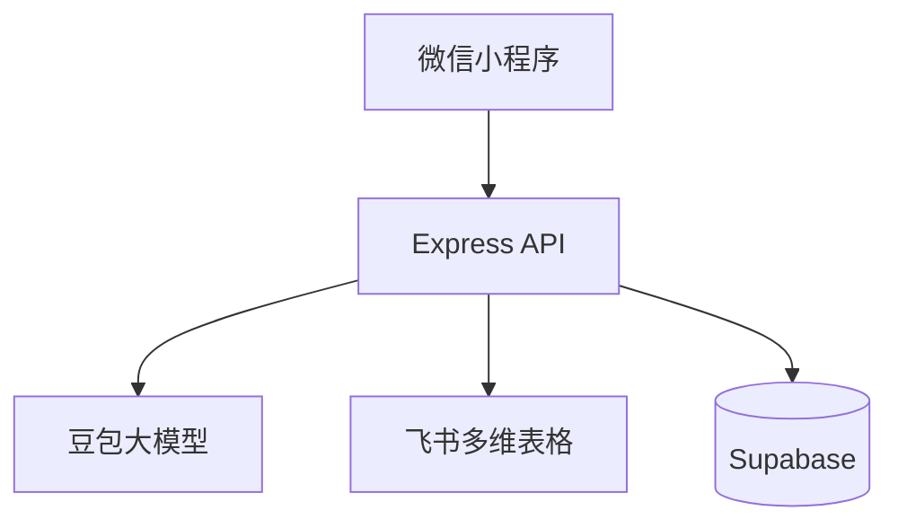

## 1. 技术架构（服务端视角）

## 2. 领域模型（简化）

关键概念：
- 模块（module）：purchase / sales / inventory
- 识别结果（recognition result）：单张图片可解析出多条记录
- 复核数据（reviewed data）：人工修正/补充后的记录集合
- 写入口径：
  - 采购/库存：按 SKU_Code 聚合并累加写入
  - 销售：明细流水，逐条新增

## 3. 写入策略

### 3.1 采购/库存（累加 upsert）

1. 生成 `SKU_Code`（用于检索与去重）
2. 按 `SKU_Code` 聚合本次复核记录，得到每个 SKU 的数量
3. 在飞书表中按 `SKU_Code` 检索记录
4. 若存在：`数量 = 原数量 + 本次数量`，并写入附件字段（如有）
5. 若不存在：创建记录并写入完整字段

### 3.2 销售（明细 create）

1. 不生成/不使用 `SKU_Code` 作为唯一键
2. 每条复核记录创建一条销售明细记录
3. 销售记录包含模型字段 + 人工字段 + 附件字段

## 4. 接口清单（建议与代码对齐）

- `POST /api/recognition/upload`：上传图片并识别（需传 module）
- `POST /api/sync`：写入飞书（需传 module）
- `POST /api/sync/retry`：重试失败记录（需传 module）
- `GET /api/query/inventory`：库存查询（按货号）

## 5. 常见问题与排查

### 5.1 图片写入多维表格失败

排查顺序：
1. 上传接口是否返回 `file_token`
2. 写入接口入参的附件字段是否为 `[{file_token}]`
3. 飞书写入接口是否返回 `code=0`
4. 若存在部分成功，前端需展示 `results[].status` 与失败原因，并提供重试入口
