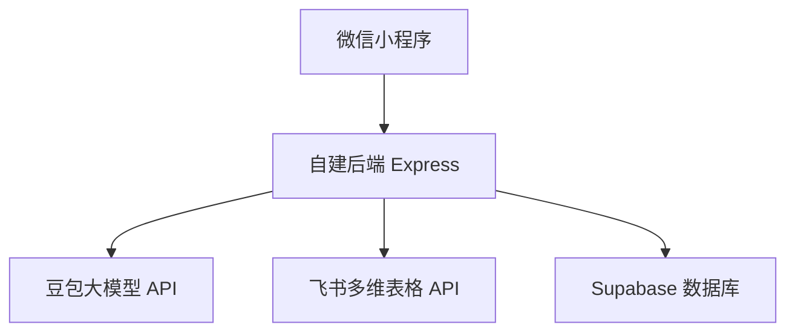

## 1. 总体架构



## 2. 小程序页面规划

两大板块：
- 数据录入：采购/销售/库存
- 数据查询：库存查询（按货号）

建议页面路由（命名可按实际项目调整）：
| 页面路径 | 页面名称 | 功能描述 |
|---------|---------|----------|
| /pages/home/home | 首页 | 入口：数据录入 / 数据查询 |
| /pages/entry/entry | 录入模块选择 | 选择采购/销售/库存 |
| /pages/index/index | 图片上传 | 拍照/相册选择，上传并触发识别 |
| /pages/review/review | 人工复核 | 按模块展示字段并编辑、同步、失败重试 |
| /pages/query/query | 库存查询 | 输入货号查询尺码与数量 |

## 3. 后端接口（对齐当前实现与规划）

### 3.1 健康检查

```
GET /health
```

### 3.2 上传识别（数据录入）

```
POST /api/recognition/upload
```

Request（multipart/form-data）：
| 参数名 | 类型 | 必填 | 描述 |
|------|------|------|------|
| image | file | 是 | 鞋盒标签图片 |
| module | string | 是 | purchase / sales / inventory |

Response（示例）：
```json
{
  "success": true,
  "task_id": "image-xxx.jpg",
  "db_task_id": "uuid",
  "results": [
    { "item_no": "3363-16", "color": "米", "size": "37", "supplier": "一代千金" }
  ]
}
```

### 3.3 同步写入飞书（数据录入）

```
POST /api/sync
```

Request（JSON）：
| 参数名 | 类型 | 必填 | 描述 |
|------|------|------|------|
| reviewed_data | array | 是 | 复核后的记录数组 |
| task_id | string | 否 | 图片文件名（用于同步阶段兜底上传图片） |
| db_task_id | string | 否 | Supabase 任务 ID（用于读取/复用预上传的 file_token） |
| module | string | 是 | purchase / sales / inventory |

Response：
- 全部成功：HTTP 200，`success: true`
- 部分失败：HTTP 207，`success: false`，并返回 `results[]` 每条 status

### 3.4 同步失败重试

```
POST /api/sync/retry
```

Request（JSON）：
| 参数名 | 类型 | 必填 |
|------|------|------|
| db_task_id | string | 是 |
| task_id | string | 否 |
| module | string | 是 |

### 3.5 库存查询（数据查询）

```
GET /api/query/inventory?item_no=xxx
```

Response（示例）：
```json
{
  "success": true,
  "item_no": "3363-16",
  "rows": [
    { "size": 37, "quantity": 2 },
    { "size": 38, "quantity": 5 }
  ]
}
```

## 4. 飞书附件写入流程

约定流程：
1. 调用飞书 Drive 上传素材接口（upload_all）获取 `file_token`
2. 写入多维表格记录时，在附件字段中传入 `[{ "file_token": "..." }]`
3. 同一张图片若解析出多条记录，可复用同一个 `file_token` 写入多条记录的附件字段

## 5. 调试与排错开关

为便于排查“图片无法写入”等问题，可开启飞书请求入参/出参日志：
- `FEISHU_DEBUG=true`：输出飞书上传与写入的入参/出参（token 默认脱敏）
- `FEISHU_DEBUG_SHOW_TOKENS=true`：输出 token 明文（仅建议本地排查使用）
